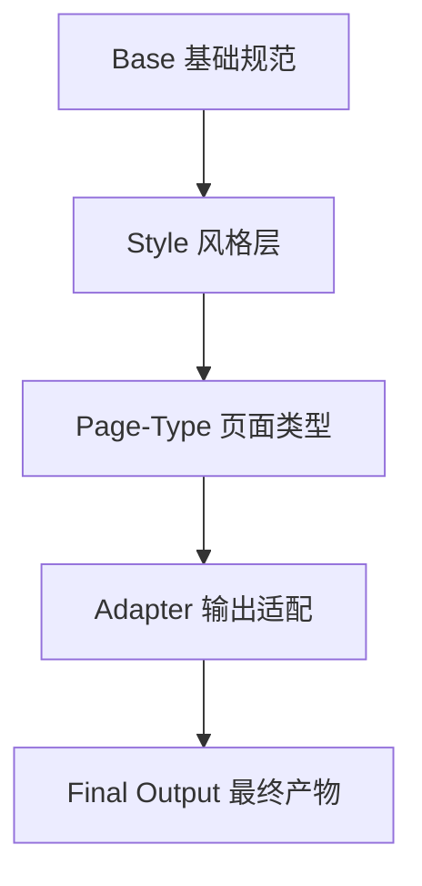

# UI-PE: UI 设计风格提示词工程库

## 📖 项目简介

**让开发者在没有 UI 设计师介入的项目中，也能通过提示词指挥 AI 生成差异化、高质量的设计。**

这是一个**可组合的提示词模块系统**，通过分层架构（Base + Style + Page-Type + Adapter），帮助你精准向 AI 表达设计需求，避免生成视觉疲劳的同质化页面。

## 🎯 项目目标

- **解决痛点**：AI 生成的页面普遍同质化，缺乏辨识度和设计感
- **核心方案**：可组合的提示词模块 + 反模板约束 + 风格签名体系
- **输出支持**：HTML/CSS 和 React+Tailwind 双输出

## 📂 项目结构

```
UI-PE/
├── README.md                    # 项目说明
├── library.html                 # 🆕 交互式提示词库页面
├── EXAMPLES-MAPPING.md          # 🆕 示例与提示词映射
├── prompts/                     # 提示词库目录
│   ├── manifest.json           # 🆕 提示词元数据
│   ├── _base/                  # 🆕 基础规范层
│   │   └── foundation.md       #     - 交付标准、反模板约束
│   ├── styles/                 # 🆕 风格层
│   │   ├── minimalist.md       #     - 极简风格
│   │   └── dashboard-dark.md   #     - Dashboard 深色风格
│   ├── page-types/             # 🆕 页面类型层
│   │   ├── landing-page.md     #     - SaaS 落地页
│   │   └── dashboard.md        #     - Dashboard 仪表板
│   ├── adapters/               # 🆕 输出适配层
│   │   ├── html-css.md         #     - HTML/CSS 输出
│   │   └── react-tailwind.md   #     - React+Tailwind 输出
│   └── landing-pages/          # 旧版风格库（保留兼容）
│       ├── minimalist.md
│       ├── dark-mode.md
│       └── ... 12 个风格
├── examples/                    # 可视化示例页面
│   ├── index.html              # 示例导航页
│   ├── elevated-design-example.html   # ⭐ 精致设计
│   ├── dashboard-elevated-example.html # ⭐ Dribbble 风格仪表板
│   └── ... 更多示例
└── QUICK-START.md               # 快速上手指南
```

> 💡 **设计理念**：分层可组合 + 反同质化约束 + 风格签名体系

## 🚀 快速开始

### 方式 1：在线浏览提示词库（推荐）

访问 GitHub Pages：**[https://henry-insomniac.github.io/UI-PE/library.html](https://henry-insomniac.github.io/UI-PE/library.html)**

- 🔍 搜索提示词
- 🏷️ 标签筛选
- 📋 一键复制
- 💻 输出目标切换（HTML/CSS 或 React+Tailwind）

### 方式 2：组合使用提示词模块

选择 4 层模块组合：

```
1. Base（基础规范）
   → prompts/_base/foundation.md

2. Style（风格层）
   → prompts/styles/minimalist.md
   → prompts/styles/dashboard-dark.md

3. Page-Type（页面类型）
   → prompts/page-types/landing-page.md
   → prompts/page-types/dashboard.md

4. Adapter（输出格式）
   → prompts/adapters/html-css.md
   → prompts/adapters/react-tailwind.md
```

### 方式 3：查看示例页面

在 `examples/` 文件夹中有多个完整的 HTML 示例：

```bash
cd examples
open elevated-design-example.html      # ⭐ 精致设计（推荐）
open dashboard-elevated-example.html   # ⭐ Dashboard（推荐）
open minimalist-example.html           # 极简风格
```

参考 `EXAMPLES-MAPPING.md` 了解每个示例对应的提示词组合。

## 📋 提示词组合示例

### 示例 1：极简风格落地页（HTML/CSS）

```
【基础规范】
遵守 prompts/_base/foundation.md 的所有基础要求

【风格】
极简风格（prompts/styles/minimalist.md）：
- 80px+ 区块间距，充足留白
- 单一品牌色（蓝色 #0066FF）
- 线性图标，2px stroke
- Inter 字体，行高 1.6

【页面类型】
SaaS 落地页（prompts/page-types/landing-page.md）：
- 产品：AI 写作工具
- 目标用户：内容创作者
- 核心功能：AI 辅助、多语言、SEO 优化

【输出】
HTML/CSS（prompts/adapters/html-css.md）
```

### 示例 2：Dashboard 仪表板（React + Tailwind）

```
【基础规范】
遵守 prompts/_base/foundation.md

【风格】
Dashboard 深色风格（prompts/styles/dashboard-dark.md）：
- 4 层灰度背景
- JetBrains Mono 显示数字
- 紫色主题 (#8b5cf6)

【页面类型】
Dashboard（prompts/page-types/dashboard.md）：
- 侧边栏导航 + 主内容区
- 4 个统计卡片
- 访问趋势图表
- 最近订单表格

【输出】
React + Tailwind（prompts/adapters/react-tailwind.md）
```

## 🎨 提示词模块系统

### 📚 4 层架构



### 🔧 模块列表

**Base（基础规范）**
- `foundation.md` - 可访问性、响应式、性能、反模板约束

**Styles（风格层）**
- `minimalist.md` - 极简风格
- `dashboard-dark.md` - Dashboard 深色风格
- *更多风格持续添加...*

**Page-Types（页面类型）**
- `landing-page.md` - SaaS 落地页
- `dashboard.md` - Dashboard 仪表板
- *更多类型持续添加...*

**Adapters（输出适配）**
- `html-css.md` - HTML/CSS 单文件输出
- `react-tailwind.md` - React + Tailwind 组件

### 🏷️ 旧版风格库（兼容保留）

12 个完整的风格模板位于 `prompts/landing-pages/`：
1. **极简风格** (Minimalist)
2. **现代科技风** (Tech Modern)
3. **专业商务风** (Business Professional)
4. **创意大胆风** (Creative Bold)
5. **玻璃态风格** (Glassmorphism)
6. **深色模式** (Dark Mode)
7. **渐变色风格** (Gradients)
8. **Bento 布局** (Bento Layout)
9. **滚动动画** (Scroll Animations)
10. **以文案为主** (Copy Focused)
11. **俏皮风格** (Playful)
12. **黑白风格** (Black & White)

## 🔧 维护与更新

- 持续收集优秀设计案例
- 根据实际使用效果优化提示词
- 添加新的设计风格分类

## 📝 贡献指南

欢迎补充新的设计风格提示词！

---

**最后更新**: 2025-12-26

